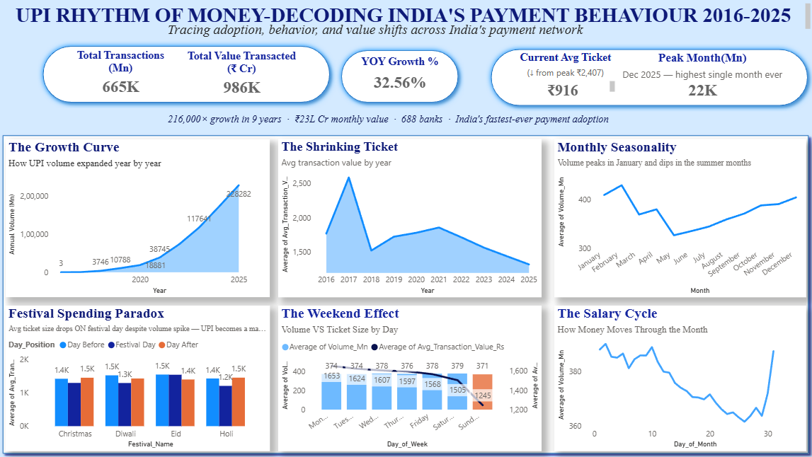
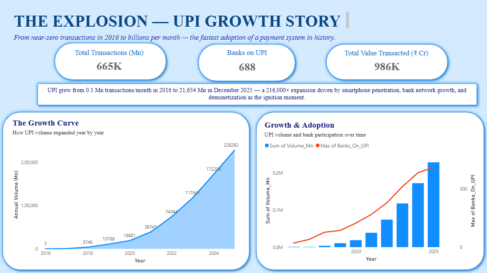
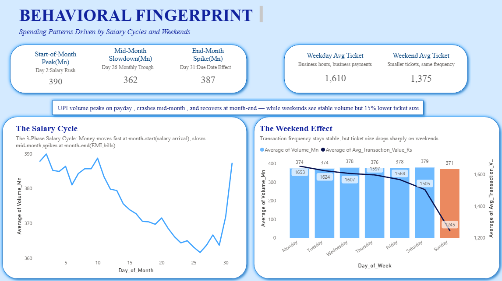
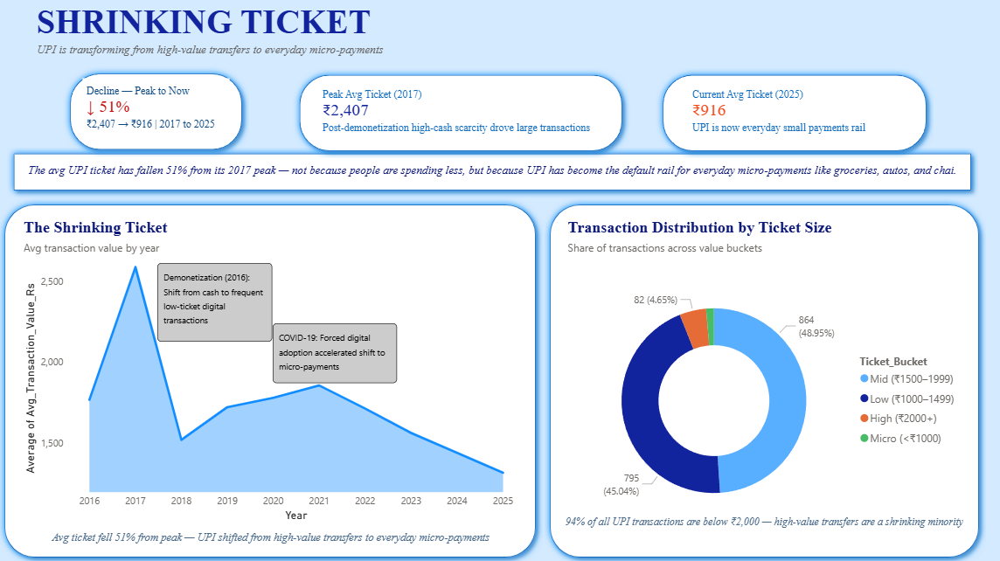
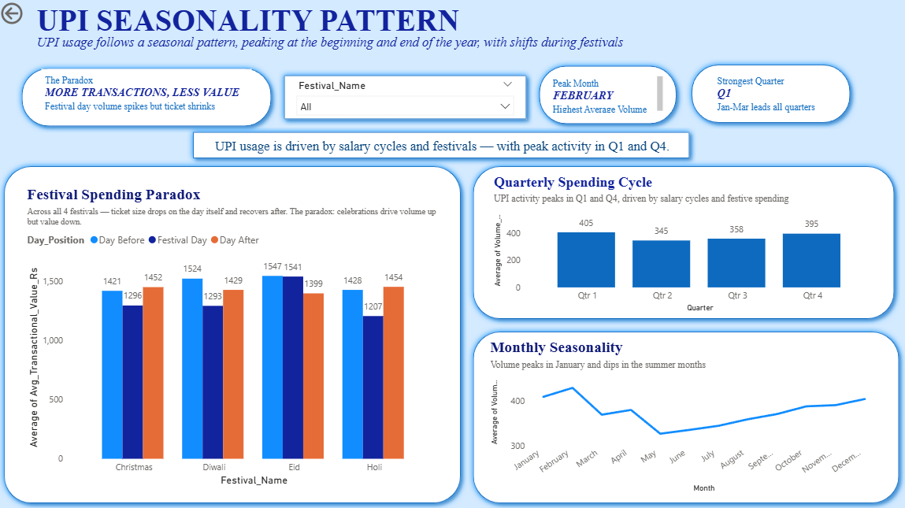

# 🇮🇳 UPI Rhythm of Money — Decoding India's Payment Behavior (2016–2026)

> *From 0.09 million transactions in August 2016 to 21,703 million in January 2026 — this is the story of how a payment infrastructure became a national habit.*

---

## 📌 Project Overview

This project is a full-stack data analytics case study on **India's Unified Payments Interface (UPI)** — the world's largest real-time payment system. Using 10 years of NPCI transaction data (2016–2026), I investigated not just *how much* UPI grew, but *how Indians actually use it* — the rhythms, cycles, and behavioral fingerprints embedded in 706,864 million transactions.

The analysis is structured around **three acts**:

| Act | Theme | Question |
|-----|-------|----------|
| 🚀 Act I | The Explosion | How did UPI go from zero to the backbone of India's economy? |
| 🧠 Act II | The Behavior | What do transaction patterns reveal about how Indians live and spend? |
| 📉 Act III | The Decline | Why is the average ticket size falling even as volumes explode? |

**Tools used:** SQL Server · Power BI · Excel Power Query  
**Data source:** NPCI (National Payments Corporation of India) — publicly available monthly reports

---

## 🔍 Key Findings

### Act I — The Explosion

**📈 Demonetization as Rocket Fuel**
When the Indian government demonetized ₹500 and ₹1,000 notes in November 2016, UPI volume jumped +190% MoM — then surged a further +586% in December 2016, the largest single-month jump in UPI history. Forced adoption became genuine habit within months.

**🦠 The COVID V-Shape**
April 2020 saw UPI's only sustained volume decline: -19.8% MoM. Full recovery followed within 2 months (+23.5% in May, +8.3% in June). By October 2020, monthly volume had *doubled* pre-COVID levels — the lockdown accelerated digital payment adoption irreversibly.

**🏦 Network Effect in Action**
Banks on the UPI network grew from 21 (2016) to 694 (2026) — a 33x expansion. Volume per bank grew from 0.01 Mn to 29.4 Mn — a 2,900x increase. Every new bank brought exponentially more transactions, a textbook network effect.

---

### Act II — The Behavior

**📅 The Salary Cycle (Day-of-Month Analysis)**
UPI transactions follow a precise 3-phase monthly rhythm:
- **FLUSH** (Days 1–10): Ticket size ₹1,600–1,772 — rent, EMIs, investments
- **DRIFT** (Days 11–26): Steady decline to ₹1,405 — retail spending
- **RECOVERY** (Days 28–31): Jumps back to ₹1,644–1,708 — advance salary recipients

A 21% peak-to-trough drop in ticket size across the month, every month, like clockwork.

**📆 The Weekend Effect**
Volume is virtually identical on weekdays vs weekends (375.9 Mn vs 374.9 Mn — a 0.3% gap). But value drops 14.3% on weekends (₹56,924 Cr vs ₹48,760 Cr). UPI usage frequency is constant; the *purpose* of transactions shifts.

**🎊 The Festival Paradox**
Counterintuitively, UPI transaction volume *dips* on major festival days (Diwali, Holi, Eid, Christmas) and ticket size falls sharply. Indians celebrate by making many small payments — street food, gifts, donations — not large ones. Post-festival recovery in ticket size is consistent across all four festivals.

**📊 Q4 Beats the Festival Quarter**
Q4 (Jan–Mar) records the highest average daily volume (404.9 Mn), edging out the festival-heavy Q3 (Oct–Dec, 395.0 Mn). The invisible driver: tax payments, advance tax deadlines, insurance renewals, and mutual fund SIPs — India's personal finance festival.

---

### Act III — The Decline (Shrinking Ticket)

**📉 50% Drop in Ticket Size Over a Decade**
Average ticket size fell from ₹2,648 (FY2016) to ~₹1,310 (FY2025) — a ~50% structural decline. This is not a warning sign; it's evidence of democratization. UPI evolved from a tool for large transfers to the infrastructure for everyday life.

**Two Distinct Phases:**
- **Phase 1** (May 2021 – mid 2023): Steep decline of ₹420 in 2 years as mass-market adoption accelerated
- **Phase 2** (mid 2023 – Feb 2026): Flattening curve — a possible structural floor emerging

**The Micro-Payment Era**
Days with average ticket size below ₹1,000 first appeared in August 2023 and now account for a growing share of all transactions. High-value days (₹2,000+) disappeared entirely after April 2023. UPI has become India's cash replacement for chai, autos, and groceries.

---

## 🛠️ Tech Stack & Architecture

```
Raw Data (NPCI PDFs/reports)
        ↓
Excel Power Query — Data cleaning, reshaping, 3 master tables
        ↓
SQL Server (.\SQLEXPRESS) — Database: UPI_Rhythm_of_Money
        ↓
13 SQL Queries across 5 analytical sections
        ↓
Power BI — Interactive dashboard (5 pages, light theme)
```

**Three master tables:**
| Table | Description | Rows |
|-------|-------------|------|
| `UPI_Monthly` | Monthly aggregates: volume, value, banks on network | 119 months |
| `Monthly_Statistics` | Derived monthly metrics | 119 months |
| `Daily_Statistics` | Daily transaction data: volume, value, ticket size, day of week | 1,765 days |

---

## 📁 Repository Structure

```
UPI-Rhythm-of-Money/
│
├── 📂 SQL/
│   ├── Section_1_Growth_Story/
│   │   ├── Q1_1_Full_Growth_Timeline.sql
│   │   ├── Q1_2_COVID_Collapse_Recovery.sql
│   │   └── Q1_3_Demonetization_Window.sql
│   │
│   ├── Section_2_User_Behaviour/
│   │   ├── Q2_1_Day_of_Week_Pattern.sql
│   │   ├── Q2_2_Weekend_vs_Weekday.sql
│   │   ├── Q2_3_Day_of_Month_Salary_Cycle.sql
│   │   ├── Q2_4_Month_of_Year_Seasonality.sql
│   │   └── Q2_5_Festival_Paradox.sql
│   │
│   ├── Section_3_Ticket_Size/
│   │   ├── Q3_1_Annual_Ticket_Trend.sql
│   │   ├── Q3_2_Monthly_Ticket_Trend.sql
│   │   └── Q3_3_UPI_Transaction_Size_Segmentation.sql
│   │
│   ├── Section_4_Bank_Network/
│   │   └── Q4_1_Bank_Growth_Timeline.sql
│   │
│   └── Section_5_Seasonality/
│       └── Q5_1_Quarter_Wise_Pattern.sql
│
├── 📂 Data/
│   ├── SQL_Results/          ← CSV exports of all 13 SQL queries
│   └── Master_Files/          ← Source Excel files (Power Query)
│
├── 📂 Dashboard/
│   └── UPI_Rhythm_of_Money.pbix
│
├── 📂 Reports/
│   └── UPI_Insight_Report.pdf  ← Full written analysis
│
└── README.md
```

---

## 📊 Dashboard Preview

> *Power BI dashboard — 5 pages, light theme*

| Page | Focus |
|------|-------|
| 🏠 Master Dashboard | Top-level KPIs and navigation |
| 🚀 The Explosion | Growth timeline: demonetization, COVID, network effect |
| 🧠 Behavioral Fingerprint | Day-of-week, Salary cycle and The we |
| 📉 Shrinking Ticket | Ticket size decline curve and segmentation |
| 📅 Seasonality | festival paradox, Quarter-wise and month-wise patterns |

### Page 1 — Master Dashboard


### Page 2 — The Explosion


### Page 3 — Behavioral Fingerprint


### Page 4 — Shrinking Ticket


### Page 5 — Seasonality


---

## 💡 Why This Project

India's UPI story is one of the most consequential technology policy decisions of the 21st century. As an economist by training and a data analyst by practice, I wanted to go beyond the headline numbers and ask: *what does this data actually reveal about human behavior?*

The answer is a system that has internalized itself into the rhythm of Indian life — salary day, festival morning, Sunday groceries, last-day-of-month rent. This project is my attempt to make that invisible rhythm visible.

---

## 👤 About Me

**Pinaki** — Data Analyst | Economist  
📍 Bangalore, India  
🎓 M.A. Economics, Loyola College Chennai | Google Data Analytics Professional Certificate  
💼 ~1.5 years experience in business operations & analytics at IndiQube Spaces

I work at the intersection of data, economics, and real-world impact. Currently open to **Data Analyst** and **Research/Policy Analyst** roles.

- 🔗 [LinkedIn](#) - www.linkedin.com/in/pinaki-kalita
- 📧 [Email](#)- pinakikalitawork@gmail.com

---

*Data source: NPCI (npci.org.in) — publicly available UPI transaction statistics*  
*Analysis period: August 2016 – February 2026*
